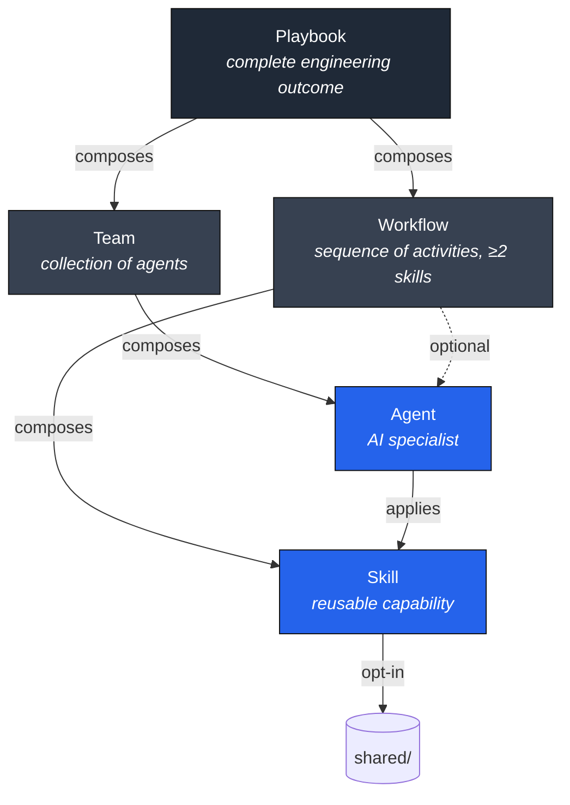
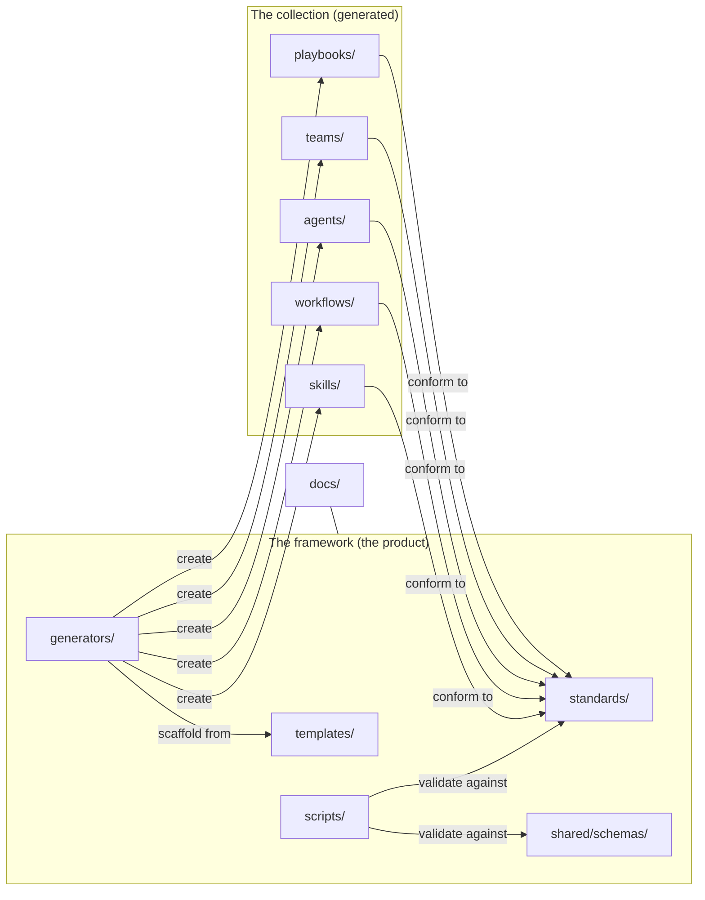
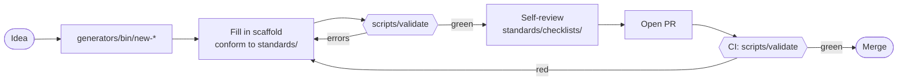

# Architecture Diagrams

> Visual companion to [ARCHITECTURE.md](../ARCHITECTURE.md) and
> [standards/architecture.md](../standards/architecture.md). Mermaid renders natively on
> GitHub; ASCII fallbacks are included for plain-text viewers.

## 1. The artifact hierarchy (5 tiers)



**Rule:** composition points **down** only; the graph is acyclic (enforced by
`scripts/check-links`).

ASCII fallback:
```
Playbook ── composes ──▶ Team ── composes ──▶ Agent ── applies ──▶ Skill ─▶ shared/
   └─────── composes ──▶ Workflow ──▶ Skill (≥2) [+ Agent] ───────────────▶
```

## 2. Repository structure



## 3. The authoring + validation loop



`scripts/validate == CI` — the same gate runs locally and in CI, so "passes locally"
means "passes CI."

## 4. Validation pipeline (what `scripts/validate` runs)

```
check-placeholders  (pure shell)  ─┐
lint                (pure shell)   ├─▶ PASS/FAIL
schema + links      (Python adapter, graceful degrade) ─┘
                    │
   errors → fail (missing files, bad naming, placeholders,
                  schema violations, metadata≠frontmatter, cycles)
   warnings → pass (missing recommended files, pending references)
```
